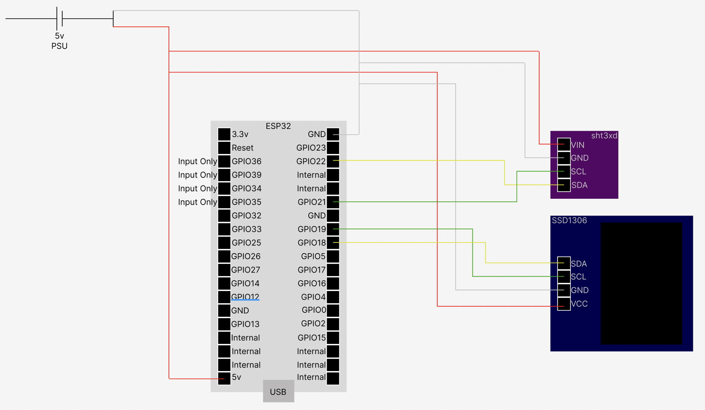

# Climate Monitoring
Temperature and humidity monitoring with a screen

## Bill of Materials
The bill of materials is in the file `BOM.md` in this directory. Please be aware that some or all of the links may be affiliate links. Feel free to use them, or search for the part on your own.

## Wiring
If you purchased the ESP32 from the link in the Bill of Materials, please refer to this wiring diagram:

## Configuring the device
Create a new device in ESPHome like you normally would. When it's created, click the edit button. You should now be presented with a text editor with the file `[device-name].yaml`.

Under the line that says `captive_portal:`, paste the contents of the `config.yaml` file in this directory. You may want to change some parameters like component names, or pins if you're usinga different ESP board than I am.

Once you are happy with the config, click save, install, and then wirelessly. This will send an OTA update to your device.

## Things to change
- Line 17 (name): I recomend changing this to something more descriptive, like 'Living Room Temperature'.
- Line 18-19 (filters): You can leave this if you want temperature readings in farenheight, but if you want celcius just delete these two lines.
- Line 22 (name): I recomend changing this to something more descriptive, like 'Living Room Humidity'.

> :warning: **If you did not follow the wiring diagram or used a different board,** you may also want to change the following:

- Line 7 (i2c_bus_a sda pin): Refer to your board's pinout. Can be any GPIO pin that isn't input only.
- Line 8 (i2c_bus_a scl pin): Refer to your board's pinout. Can be any GPIO pin that isn't input only.
- Line 10 (i2c_bus_b sda pin): Refer to your board's pinout. Can be any GPIO pin that isn't input only.
- Line 11 (i2c_bus_b scl pin): Refer to your board's pinout. Can be any GPIO pin that isn't input only.

## Notes
This device requires two i2c buses. This means it's incompatible with the ESP8266, which only supports one i2c bus.